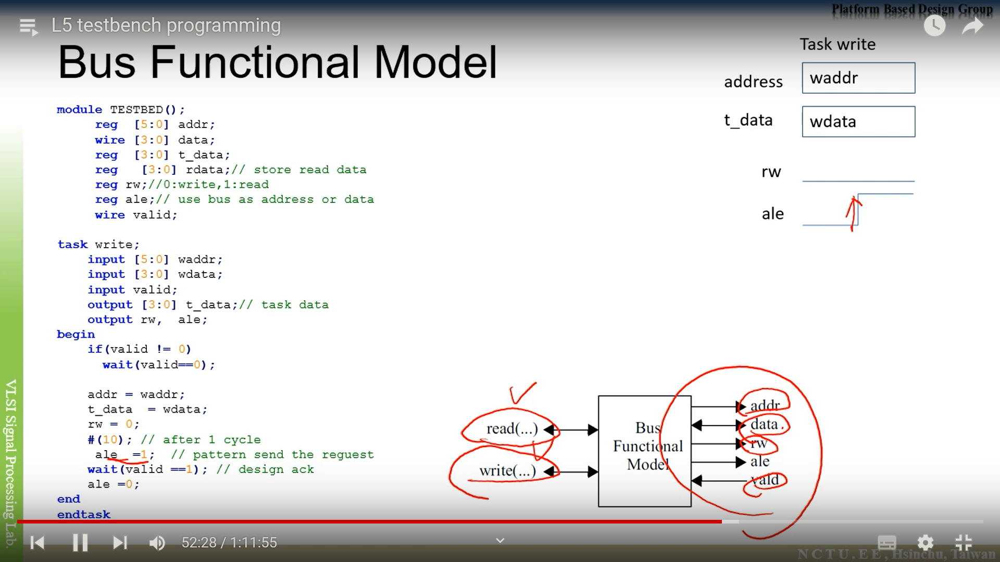

# Testbench and design
## Basics
- CLOCK GEN
- RESET
- INIT
- SEND STIMULUS & MAIN FLOW
- CHECK RESPONSE
    - NO RESET OUTPUTS
    - WRONG ANSWER
- REPEAT CHECKING

# Best one for complex design
## Algorithm
- Usually create a model using C,Matlab or python. Then we can generate input test vectors and golden outputs.

# Checking
- Note usually we check the answer at NEGEDGE CLK!
```verilog
@(negedge clk)
    // Statement

```

# TB coding
- Initial block
- Delay for n units of time
- Full high-level constructs
- I/O file

# Test Pattern & Test Vectors
## Example
- In verilog, _ would be ignored, 000 is input test vector, 1 is golden output
```
    000_1
    001_0

```
## Reading test vectors
- Reading test vectors into your pseudo RAM in your design.
```
$readmemb("example.tv",testbectors);

```

## Jump Over reset
- We first jump over the first reset! Since reset should not be counted!
```verilog
    if(~rst_n)
    begin


    end
```

## Initial blocks
- Initial blocks all start at same time and can be used simultaneously. #0.Statements S1 and S2 both initiates at time instance 0.

```verilog
initial
begin
    S1
end

initial
begin
    S2
end

```

## task
- Must be written within module, NOT SYNTHESIZABLE!!

## Function
- Pack common COMBINATIONAL OPERATION into 1, which is synthesizable!
- Having single one return value, has only input arguments, however returns a single value through the function name.


## Writing testbench recommended book
- Writing testbench

# Bus functional model
- Extremely useful testbench model when you are trying to perform master and slave writing and reading.



## Input
- READ()
- WRITE()mj05
- DATA
- VALID

## Output
- ADDR
- RW
- ALE

## TB coding
- wait, stucks in timing, until the condition is met.


## Pros
- By using this Bus functional model, testbench becomes a lot cleaner and more readable!
- Testbench task, can access global variables!


## CLK should not be input of task!


# FILE I/O
- Important driver code template
```verilog
initial begin
    repeat(10) @ (posedge clk);
    while (!feof(in))
    begin
        @(negedge clk);
        statusI = $fscanf(in,$h $h\n),din[31:16],din[15:0]);
    end

```
- fwrite does not insert a newline at each write, must insert it by yourself.


# Writing into pseudoRAM
## readmemh
- Reads a single line of data from memory file.


## writememh
- Immediately writes all memory info declared within module to file.
- The  @ 55 specify when writing file into dram, it starts writing value into address 55 of the pseudoDRAM declared within your testbench.


# Procedure
## Algorithm
1. From the spec, produce a NxN array.
2. Interleaved this NxN array even coordinates with walls and odd coordinates with path.
3. Surround this NxN array with another layer of wall so that boundary condition can be handled.
4. Use DFS recursive algorithm to break the wall randomly, and generate the maze.
5. Solve the maze using Dead-end filling algorithm.
6. Write out the input test vectors and the golden output into 2 seperate files.

## TB
1. Generate the TB structure, follow the rules and refer to senior's design.
2. Test your testbench against the coded design of seniors. If pass move forward.

## HW architecture
1. Transform the dead-end filling algorithm into HW architecture.
2. Note, preprocessing can be done on the maze to simplify boundary checking condition.
3. Also remember that the path must be recorded for this maze traveling problem.

# Bugs
- Problem occurs in calling $random(SEED), no idea why the value cannot be assigned.
- Works only for reg gap[3:0], integer is not usable.
- How to add the path to another file from the current folder in Moba???

# Advanced techniques in reducing area and critical path
1. The mantissa of floating point can actually be reduced due to the allowable error of 1%.
2. I.e. one can try to reduce the mantissa bits from 23 to bits less than 23. As long as you still meet the criteria.
3. Look up table can be used as long as the number of inputs are fixed, simply calculate all possible value and print it out , load the value in as LUT to allow small area fast search.