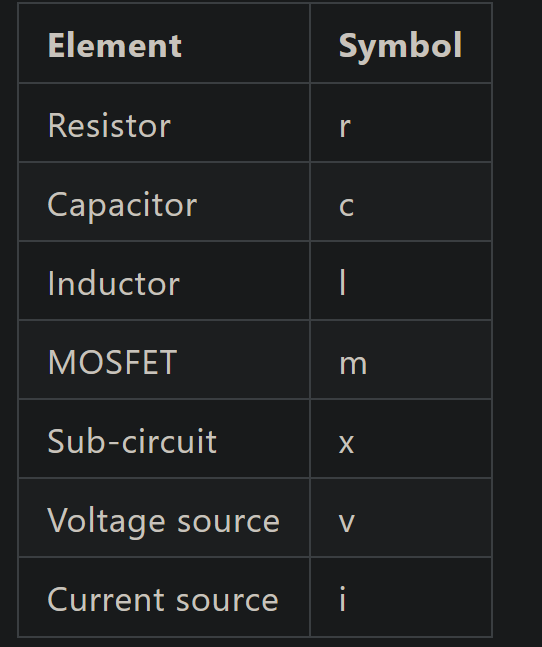

# SRAM
- Timing units are used to determine when to turn on or off the decoders.


# Read operation path
1. input latch -> Timing units -> row decoder -> SRAM array -> sense amp -> col decoder -> address out latch

# Write operation
1. We must ensure data arrives before address arrives.

# Error
1. If no intersects in voltage graph, error. So discharge and charge must have intersection.

# Butterfly curve
1. It is created using the VTC if inverters.
2. Difference and then divided by sqrt2.

# SNM(Static noise margin)
1. The square of the butterfly is the SNM.

# BL % BLB
1. Prefer .ic

# SNM
1. Using the formula created on paper, we can rotates the VTC intersection curves, and get the boxes.


# Problem
1. Why use v(??.BL) here? I dont know why? What should be connected onto ??.BL ? Since I simply connect BL node onto it.
- This is used for calling out subckt nodes.
```s
    v(Xsram6t.BL) = xvdd

```

2. How to define the parameter and then use it as the initial condition for my capacitance or node?
- Use parameter for initial condition setting, global VDD and GND is not allowed.
```s
    .param xvdd 0.7
    .ic v(subckt.BL) = xvdd

```

3. What is the difference of nodeSet and initial condition? Like why do we use it here?
- Nodesets are used to aid hspice of finding the convergence point and also it sets the volatge of that node to a certain voltage.

4. What happens to the Waveform of READ and WRITE? Why does it suddenly jumps all the way up to a non-existing high voltage?
- Since you use the wrong mos cell, for sram nmos_sram shall be used, thus next time whenever simulation is conducted, one must first ask which cell are being used. What type of nmos,pmos is used.

```s
    .nodeset V(q)= xvdd * ?? need to be edited
    .nodeset V(qb)= xgnd * ?? need to be edited

```

5. Why sometimes random naming of instance would not work?
- Some vocabs are already reserved for circuit instantiation, so you should beware of the starting of the letter.
<p align="center">
  
</p>